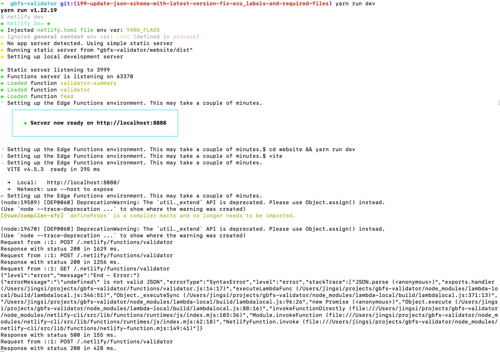
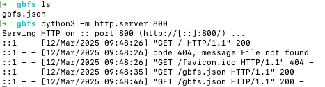

# How to test GBFS Validator locally

## 1. Download each file of a feed

For example, use this [Bolt feed](https://mds.bolt.eu/gbfs/3/336/gbfs) that contains the 3 major versions. Put the downloaded file in an empty folder, like `gbfs`.

## 2. Introduce errors in the local feed

Introduce errors as per requirement.

## 3. Run Commands in `gbfs-validator` project folder

1. Navigate to the `gbfs-validator` folder:
    ```sh
    cd gbfs-validator
    ```

2. Install dependencies:
    ```sh
    yarn
    ```

3. Start the development server:
    ```sh
    yarn run dev
    ```

If successful, you’ll see **Server now ready on http://localhost:8888**



## 4. Run a server locally in the folder that contains the local feed

1. Start a local server:
    ```sh
    python3 -m http.server 800
    ```



2. Replace the feed URL

Replace `https://mds.bolt.eu/gbfs/3/336/gbfs` with `http://localhost:800/gbfs/3/336/gbfs`.

3. Validate the feed

Go to [http://localhost:8888](http://localhost:8888) and validate your local feed `http://localhost:800/gbfs/3/336/gbfs`.
